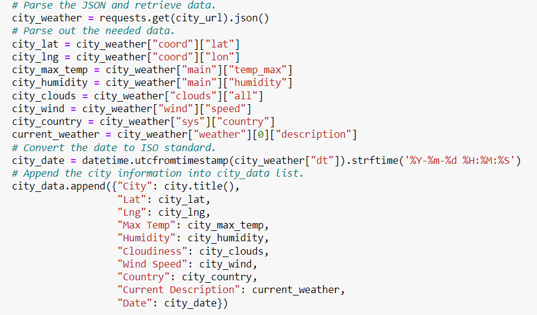
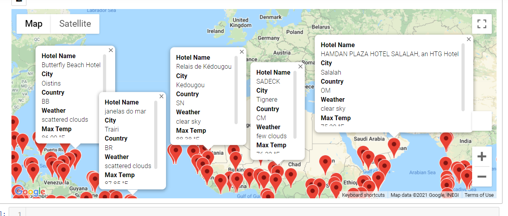
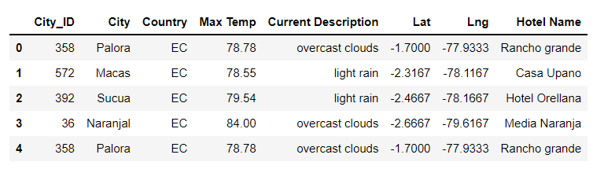
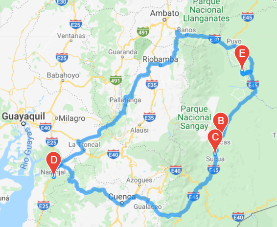
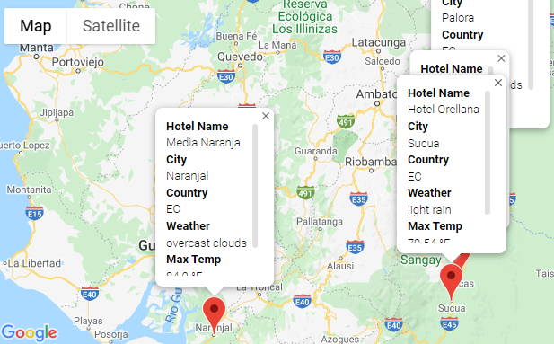

# World_Weather_Analysis

## Overview of Project

**Purpose:**  
The purpose of this project is to create a database with nearby cities using RNG (random number generator) for latitudes and longitudes. Then using API calls and gmaps to create a user specific minimum and maximum temperatures for potential vacation destinations.  

## Resources:
- Data Source: WeatherPy_Database.csv, WeatherPy_Vacation.csv
- Software: Python 3.9.7, Anaconda 4.10.3, Jupyter Notebook 6.4.5, [openweathermaps](https://openweathermap.org/), [Google Maps](https://maps.google.com)

## Analysis and Results

**Analysis and Results:**  
For this project, we first generated random numbers from -90 to 90 twice to gather random latitudes and longitudes. We then joined the two different lists together to get our coordinates. From there, we used `citipy.nearest_city()` to find the nearest city with the random coordinates. Next we used [openweathermaps](https://openweathermap.org/) to make an API call to gather different information about the city and add them to a dataframe.  
  
We created a user specific min and max temperature input to filter our cities list by the specified temperature for potential vacation destinations. We then displayed the filtered cities onto a gmap, with information markers on nearest hotel, city, country, current weather, and max temperature.  
  
We also created an itinerary where we can display a possible vacation destination. There were four different cities in Ecuador that I saw that could be a possible vacation destination. City name, country, current weather, max temp, and nearest hotel name are displayed in the markers for each city.  
  
  
  

## Challenge Summary

**Summary**  
The purpose of this project is to create a database of coordinates and locate different nearby cities, and using those specific city data, we can use API calls and gmaps to create different layers that can be display different information on those maps. We specifically used these maps to find potential cities for vacation destinations based on user temperature input.  
